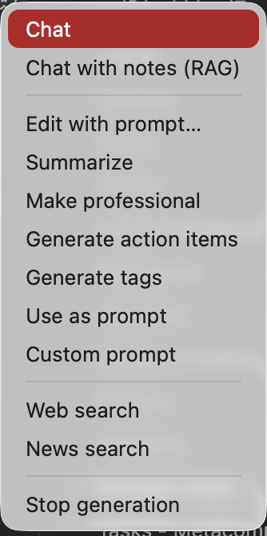
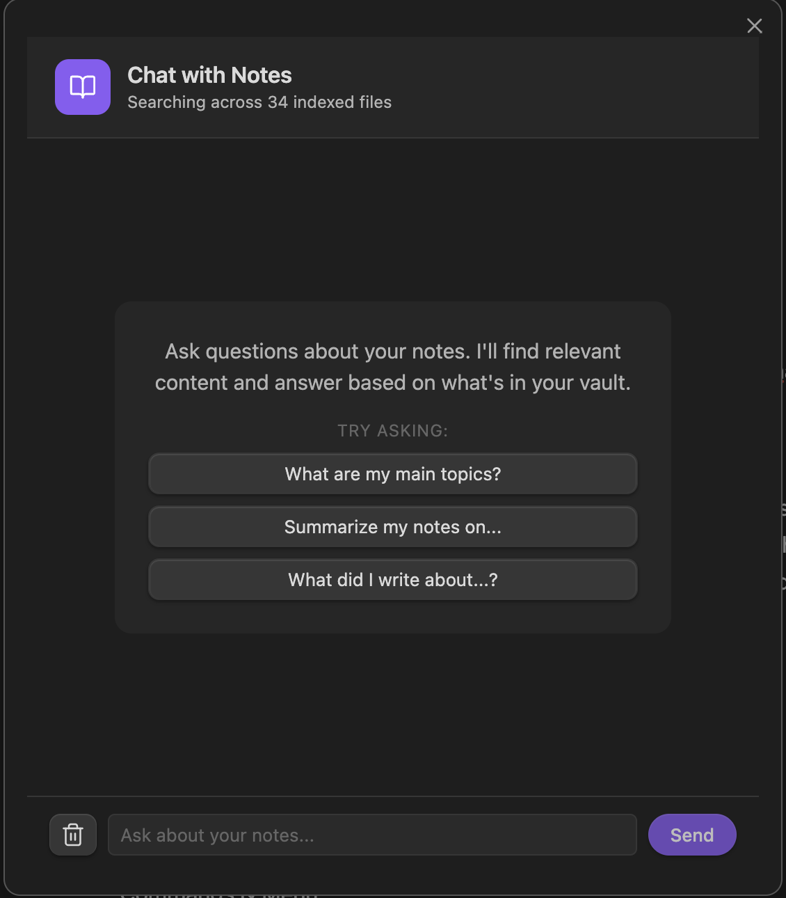
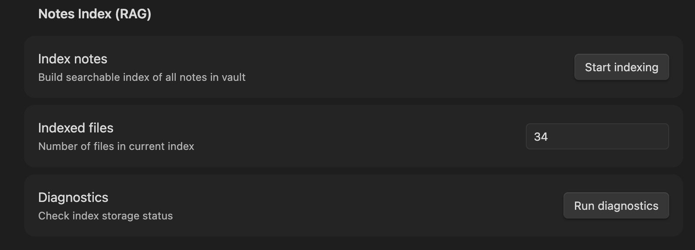
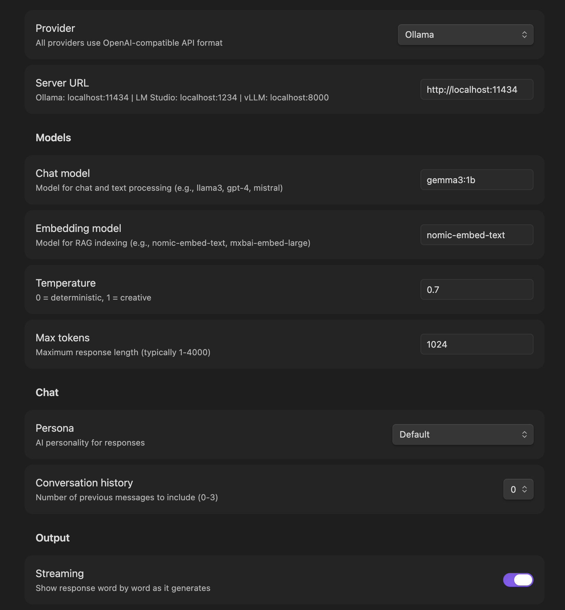

# Local LLM Helper

An Obsidian plugin that brings the power of local LLMs directly into your notes. Process text, chat with AI, search your vault semantically — all while keeping your data private and local.

  

## Features

### 🔌 Multi-Provider Support

Works with **any server that supports the OpenAI API format** (`/v1/chat/completions`):
- **Ollama** - Run open-source models locally
- **OpenAI** - Use GPT models with your API key
- **LM Studio** - Local inference with a GUI
- **vLLM, LocalAI, text-generation-webui**, and more

Switch providers anytime from settings. Configure temperature, max tokens, and streaming.

### ✍️ Text Processing

Transform selected text with AI-powered commands:

| Command | What it does |
|---------|--------------|
| **Summarize** | Condense text while preserving key information |
| **Make Professional** | Rewrite in a formal, polished tone |
| **Generate Action Items** | Extract actionable tasks from text |
| **Custom Prompt** | Use your own saved prompt |
| **Use as Prompt** | Send selection directly to LLM |
| **Edit with Prompt** | Choose from 8 presets or write custom instructions |

All commands available via Command Palette (prefix: `Text:`) or ribbon menu.

### 💬 Chat Interfaces

**LLM Chat** - General conversation with your LLM
- Remembers last 3 exchanges for context
- Supports all configured personas

**RAG Chat** - Chat with your indexed notes
- Semantic search across your vault
- Clickable source references
- Example queries to get started

### 📚 Notes RAG (Retrieval-Augmented Generation)

Index your vault for semantic search and AI-powered Q&A:

- **Smart Chunking** - Documents split with overlap for better context
- **Incremental Indexing** - Only re-indexes changed files
- **Content Preprocessing** - Strips frontmatter and cleans markdown
- **Multiple Providers** - Works with any OpenAI-compatible embeddings endpoint

### 🌐 Web Integration

- **Web Search** - Search the web using Brave API
- **News Search** - Get recent news on any topic

### 🎭 Personas

Customize AI behavior with built-in personas:
- Physics Expert
- Fitness Coach
- Software Developer
- Philosopher
- Teacher
- Scientist
- Creative Writer

### ⚙️ Organized Settings

Settings organized into clear sections:
- Provider Configuration
- Server Settings
- Model Selection
- RAG Configuration
- Response Formatting
- Custom Prompts
- About & Changelog

### 🎯 Command Organization

All commands use clear prefixes for easy discovery:
- `Text:` - Text transformation commands
- `Chat:` - Open chat interfaces
- `Web:` - Web and news search
- `Notes:` - RAG indexing and management
- `Settings:` - Plugin configuration

## Installation

### From Community Plugins (Recommended)

1. Open Obsidian Settings → Community Plugins
2. Click "Browse" and search for "Local LLM Helper"
3. Install and enable the plugin

### Manual Installation

1. Download the latest release from [GitHub Releases](https://github.com/manimohans/obsidian-local-llm-helper/releases)
2. Extract to your vault's `.obsidian/plugins/` folder
3. Enable in Settings → Community Plugins

## Quick Start

### 1. Configure Your Provider

Go to Settings → Local LLM Helper and choose your provider:

**For Ollama:**
- Server: `http://localhost:11434`
- Model: `llama3.2` (or your preferred model)
- Embedding Model: `mxbai-embed-large`

**For OpenAI:**
- Server: `https://api.openai.com`
- API Key: Your OpenAI API key
- Model: `gpt-4` or `gpt-3.5-turbo`

**For LM Studio:**
- Server: `http://localhost:1234`
- Model: Leave blank (uses loaded model)

### 2. Try Text Commands

1. Select some text in a note
2. Open Command Palette (`Cmd/Ctrl + P`)
3. Type "Text:" to see available commands
4. Choose an action like "Summarize" or "Make Professional"

### 3. Index Your Notes

1. Command Palette → "Notes: Index notes for RAG"
2. Wait for indexing to complete
3. Command Palette → "Chat: RAG Chat" to chat with your notes

## Changelog

### v2.3.1
**New Features**
- **Redesigned RAG Chat**: New interface with welcome message, example queries, and clickable sources
- **Changelog in Settings**: View version history anytime from Settings → About

**RAG Improvements**
- Smarter chunking with overlap for better context preservation
- Incremental indexing - only re-indexes changed files
- Content preprocessing - strips frontmatter and cleans markdown
- Better error messages when notes aren't indexed

**UI/UX**
- Commands organized with prefixes (Text:, Chat:, Web:, Notes:)
- Ribbon menu grouped logically with separators
- Settings page organized into 7 clear sections
- All prompts improved for better LLM output
- Persona prompts rewritten to be more actionable

### v2.3.0
- **Edit with Prompt**: Edit selected text with preset or custom prompts
- **Security Updates**: Fixed dependency vulnerabilities
- **Better Error Messages**: Clearer embedding failure messages

### v2.2.1
- Fixed re-embedding issue on every restart
- Proper persistent storage for embeddings
- Storage diagnostics command

### v2.2.0
- Multi-provider support (Ollama, OpenAI, LM Studio)
- Easy provider switching in settings
- Configurable temperature and max tokens

Older versions

### v1.1.3
- Chat history stored (3 previous exchanges)
- Response formatting options

### v1.1.1 - v1.1.2
- LLM chat functionality with personas
- Modern chat interface UI

### v1.0.10
- Ollama support
- OpenAI API compatibility

### v1.0.9
- Added persona selection

### v1.0.8
- Replace/append output options

### v1.0.7
- Command palette integration

### v1.0.6
- Custom prompt capability
- Action items generation

### v1.0.5
- Streaming output support

### v1.0.4
- Initial release with summarize, rephrase, and generate

## Requirements

- Obsidian 1.7.0 or later
- Any LLM server with OpenAI-compatible API (Ollama, LM Studio, OpenAI, vLLM, etc.)

## Support

- [Report Issues](https://github.com/manimohans/obsidian-local-llm-helper/issues)
- [Buy Me a Coffee](https://buymeacoffee.com/manee)

## License

MIT License - see [LICENSE](LICENSE) for details.
