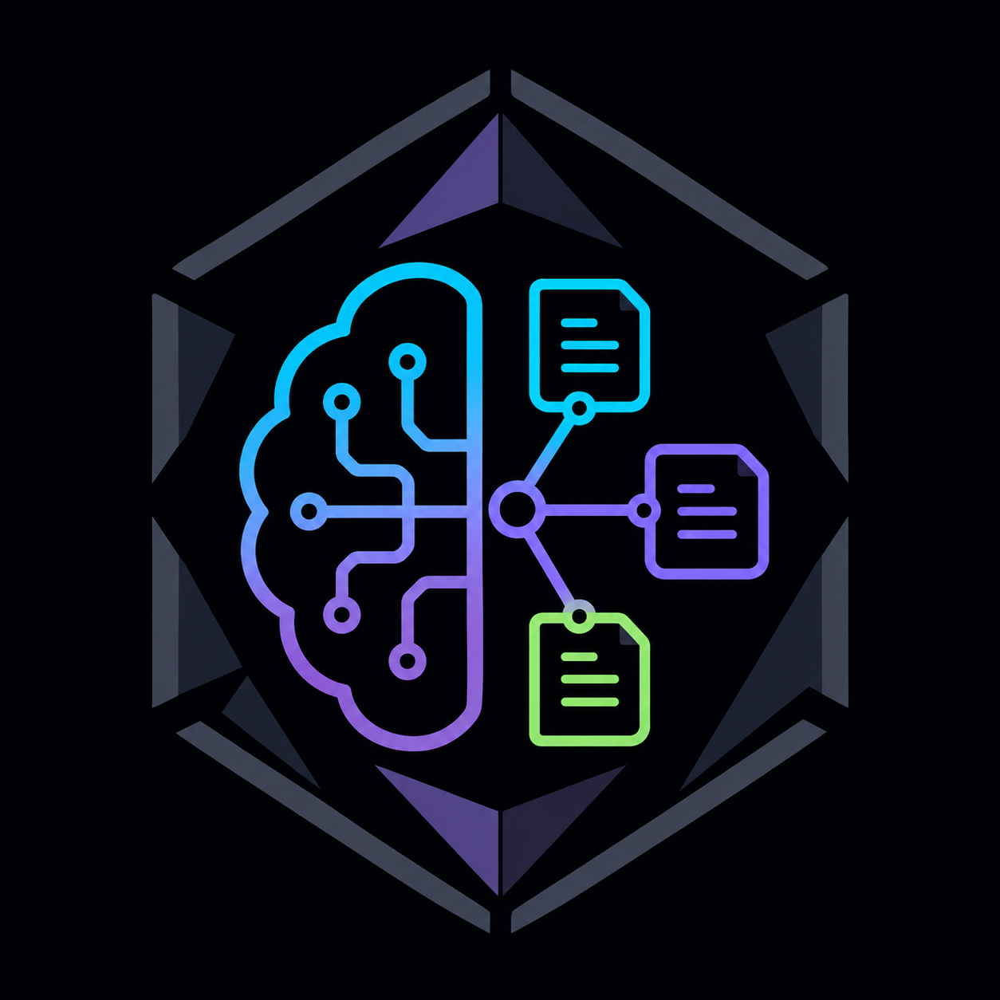

  

<h1 align="center">Local LLM Helper</h1>

  <strong>Private AI for your Obsidian vault.</strong> 
  Chat with your notes, find related ideas, run review workflows, and transform text with your own local or OpenAI-compatible models.

  
  
  
  

  <a href="PRIVACY.md">Privacy and capabilities</a> ·
  <a href="CONTRIBUTING.md">Contributing</a> ·
  <a href="https://github.com/manimohans/obsidian-local-llm-helper/releases">Releases</a>

## Why Use It?

Local LLM Helper turns Obsidian into a private AI workspace without forcing your notes into someone else's app. It works with Ollama, LM Studio, vLLM, LocalAI, OpenAI, and most servers that expose OpenAI-compatible endpoints.

- **Keep your notes in Obsidian** - ask questions, summarize, rewrite, and review without changing tools.
- **Use local models when privacy matters** - point the plugin at your own chat and embedding server.
- **Search by meaning, not just keywords** - index your vault and retrieve the notes that actually matter.
- **Move from chat to action** - generate review notes, task updates, and project summaries behind explicit approval cards.

## Highlights

| Capability | What you get |
| --- | --- |
| **RAG chat over your vault** | Ask questions against indexed notes with clickable source references. |
| **Scoped note chat** | Limit chat to the current note, current folder, selected notes, tags, or the whole vault. |
| **Related Notes sidebar** | Keep semantically nearby notes visible while writing or researching. |
| **Manual workflow runner** | Draft weekly reviews, meeting tasks, and project status updates from note context. |
| **Text commands** | Summarize, rewrite, extract action items, use custom prompts, and run saved prompts. |
| **Vault Actions** | Let chat propose note writes, then approve or reject each write before it touches your vault. |
| **Personas and model picker** | Customize assistant behavior and browse models directly from your server. |

## See It In Action

### Chat With Your Notes

Ask questions against your indexed vault, inspect sources, and narrow the context when you need a more precise answer.

  

### Fast Commands From Obsidian

Run text transformations, chats, searches, note indexing, and workflows from the ribbon menu or command palette.

  

### Settings Built For Real Model Setups

Configure providers, chat models, embedding models, personas, reasoning extraction, RAG indexing, saved prompts, workflow defaults, and web search.

  

## Features

### 🔌 Multi-Provider Support

Works with **any server that supports the OpenAI API format** (`/v1/chat/completions`):
- **Ollama** - Run open-source models locally
- **OpenAI** - Use GPT models with your API key
- **LM Studio** - Local inference with a GUI
- **vLLM, LocalAI, text-generation-webui**, and more

Switch providers anytime from settings. Configure temperature, max tokens, and streaming.

### 📚 Notes RAG

Index your vault for semantic search and AI-powered Q&A:

- **Smart chunking** - Documents split with overlap for better context.
- **Incremental indexing** - Only re-indexes changed files.
- **Content preprocessing** - Strips frontmatter and cleans markdown.
- **Attachment-aware retrieval** - Index PDF attachments by default, with opt-in local OCR for images and scanned PDFs.
- **Multiple embedding providers** - Works with OpenAI-compatible embedding endpoints.
- **Configurable retrieval** - Tune how many chunks are sent to the model.

### 🧭 Related Notes Sidebar

Keep semantic context visible while you write:

- Uses selected text when you highlight a passage.
- Falls back to the full active note when nothing is selected.
- Shows related notes with scores, paths, and previews.
- Opens any match instantly or starts scoped RAG chat with selected notes.

### 🧩 Manual Workflow Automation

Run useful review recipes without giving the model autonomous write access:

- **Weekly review** - Turn recent or scoped notes into wins, open loops, and next actions.
- **Meeting notes to tasks** - Extract action items and follow-ups into a target note.
- **Project status summary** - Summarize progress, risks, blockers, and next steps.
- **Approval-first writes** - Every generated note change is reviewed before it is applied.

### ✍️ Text Processing

Transform selected text with AI-powered commands:

| Command | What it does |
|---------|--------------|
| **Summarize** | Condense text while preserving key information |
| **Make Professional** | Rewrite in a formal, polished tone |
| **Generate Action Items** | Extract actionable tasks from text |
| **Custom Prompt** | Run your single saved custom prompt |
| **Run Saved Prompt...** | Fuzzy-search and run any saved prompt |
| **Use as Prompt** | Send selection directly to your model |
| **Edit with Prompt** | Choose from presets or write custom instructions |

All commands are available via Command Palette (`Cmd/Ctrl + P`) or the ribbon menu.

### 💬 Chat Interfaces

**LLM Chat** for general conversation:
- Remembers recent exchanges for context.
- Supports all configured personas.
- Can propose approval-gated Vault Actions when enabled.
- Opens in a docked sidebar so your notes stay visible while you chat.

**RAG Chat** for note-grounded answers:
- Searches your indexed notes semantically.
- Shows clickable sources that open notes and indexed attachments.
- Supports vault, note, folder, tag, and selected-note scopes.
- Uses the same sidebar as general chat; popup variants remain available from the command palette.

### 🌐 Web Integration

- **Web Search** - Search the web using Tavily, Brave API, or a self-hosted SearXNG instance.
- **News Search** - Get recent news on any topic.
- **SearXNG Support** - Configure an instance URL in settings; the instance must enable JSON output with `json` in `search.formats`.

### 🎭 Personas

Customize AI behavior with 12 built-in personas — or create your own:
- Software Developer, Physics Expert, Fitness Expert, Stoic Philosopher
- Product Manager, Technical Writer, Creative Writer
- TPM, Engineering Manager, Executive, Office Assistant

**Edit any persona's system prompt** directly in settings. Create custom personas with your own name and instructions. Restore defaults anytime.

### 📋 Saved Prompts

Save frequently-used prompts and run them instantly:
- Each saved prompt registers as a **command in the palette** — assign hotkeys to your favorites
- **Fuzzy search picker** to quickly find and run any saved prompt
- Full CRUD in settings: create, edit, rename, delete
- Existing single "Custom Prompt" field still works alongside saved prompts

### 🧠 Reasoning Extraction

Models like **DeepSeek** and **Qwen** wrap their thinking process in `<think>` blocks. Enable reasoning extraction to automatically strip these from output:
- Strips `<think>`, `<reasoning>`, and `<thought>` blocks by default
- Configurable markers via JSON for custom formats
- Applied to text commands, chat, and RAG responses

### 🔍 Model Picker

Browse available models directly from your server:
- **Browse button** next to Chat and Embedding model fields
- Fetches from `/v1/models` endpoint (chat browse uses the chat/default server; embedding browse uses the embedding server override when set)
- Searchable picker modal — no more guessing model names
- Manual text entry always available as fallback

### ⚙️ Organized Settings

Settings organized into clear sections:
- Connection & Provider
- Models (with Browse)
- Chat & Personas
- Output & Reasoning
- Custom Prompt & Saved Prompts
- Notes Index (RAG)
- Workflow Automation
- Integrations
- About & Changelog

### 🎯 Command Organization

All commands use clear prefixes for easy discovery:
- `Text:` - Text transformation commands
- `Prompt:` - Your saved custom prompts (hotkey-assignable)
- `Chat:` - Open chat interfaces
- `Workflow:` - Run review workflows
- `Web:` - Web and news search
- `Notes:` - RAG indexing and management
- `Settings:` - Plugin configuration

## Installation

### From Community Plugins (Recommended)

1. Open Obsidian Settings → Community Plugins
2. Click "Browse" and search for "Local LLM Helper"
3. Install and enable the plugin

### Manual Installation

1. Download the latest release from [GitHub Releases](https://github.com/manimohans/obsidian-local-llm-helper/releases)
2. Extract to your vault's `.obsidian/plugins/` folder
3. Enable in Settings → Community Plugins

## Quick Start

### 1. Configure Your Provider

Go to Settings → Local LLM Helper and choose your provider:

**For Ollama:**
- Server: `http://localhost:11434`
- Model: Click **Browse** to pick from available models, or type `llama3.2`
- Embedding Model: `mxbai-embed-large`

**For OpenAI:**
- Server: `https://api.openai.com`
- API Key: Your OpenAI API key
- Model: `gpt-4` or `gpt-3.5-turbo`

**For LM Studio:**
- Server: `http://localhost:1234`
- Model: Click **Browse** to see loaded models, or leave blank for default

### 2. Try Text Commands

1. Select some text in a note
2. Open Command Palette (`Cmd/Ctrl + P`)
3. Type "Text:" to see available commands
4. Choose an action like "Summarize" or "Make Professional"

### 3. Index Your Notes

1. Command Palette → "Notes: Index notes for RAG"
2. Wait for indexing to complete
3. Command Palette → "Chat: Notes (RAG)" to chat with your notes in the sidebar
4. Command Palette → "Notes: Open related notes" to keep nearby notes visible while writing

### 4. Run a Workflow

1. Command Palette → "Workflow: Run workflow..."
2. Choose a built-in recipe
3. Confirm the note scope and output target
4. Review the generated approval card before writing anything to your vault

Notes:
- Workflows use the same indexed-note context as RAG chat, so run `Notes: Index notes for RAG` first if your vault changed.
- PDF attachments are indexed by default; image OCR and scanned-PDF OCR can be enabled in Settings → Notes Index (RAG).
- `Meeting notes to tasks` and `Project status summary` require a target note to append into.
- Workflow approvals still work even if the chat-only `Vault Actions` toggle is off.

## Changelog

### v2.4.5

**Dockable Chat Sidebar**
- Moved general and notes chat into a right-sidebar workspace view so notes stay visible while chatting.
- Added a multiline composer with target context, stop state, inline readiness/error banners, and a verification reminder.
- Improved source citations with note titles and paths that open in the main editor.

### v2.4.2

**Plugin Review Cleanup**
- Published a fresh release with matching manifest metadata.
- Added build provenance attestations for release assets.
- Clarified optional auto-index behavior and kept it disabled by default.

**Workflow Automation**
- Added a manual workflow runner for weekly review, meeting notes to tasks, and project status summary recipes
- Reused note, folder, and tag scopes across RAG chat and workflow runs
- Kept all workflow note writes behind explicit approval cards

**Related Notes Sidebar**
- Added a persistent "Related Notes" workspace view
- The sidebar updates from the current note or selected text
- Open matching notes directly or start RAG chat with selected related notes

### v2.4.0

**Saved Prompts**
- Save frequently-used prompts with title and text
- Each saved prompt registers as a command — assign hotkeys to your favorites
- Fuzzy-searchable picker modal (`Text: Run saved prompt...`)
- Full CRUD in settings: create, edit, rename, delete

**Persona Editing**
- View and edit any persona's system prompt in settings
- Create fully custom personas with your own name and instructions
- Delete custom personas, restore all defaults with one click
- Same backward-compatible persona keys — existing settings just work

**Reasoning Extraction**
- Toggle to strip `<think>`, `<reasoning>`, `<thought>` blocks from LLM output
- Useful for DeepSeek, Qwen, and other models that expose chain-of-thought
- Configurable markers via JSON for custom formats
- Applied to text commands, general chat, and RAG chat

**Model Picker**
- Browse button next to Chat and Embedding model fields
- Fetches chat models from the chat/default server and embedding models from the embedding server override when set
- Searchable picker modal — works with Ollama, LM Studio, vLLM, and others
- Manual text entry always available as fallback

**Bug Fixes**
- Fixed server URL normalization to prevent missing protocol errors
- Resolved security vulnerabilities and cleaned up dependencies

### v2.3.1
**New Features**
- **Redesigned RAG Chat**: New interface with welcome message, example queries, and clickable sources
- **Changelog in Settings**: View version history anytime from Settings → About

**RAG Improvements**
- Smarter chunking with overlap for better context preservation
- Incremental indexing - only re-indexes changed files
- Content preprocessing - strips frontmatter and cleans markdown
- Better error messages when notes aren't indexed

**UI/UX**
- Commands organized with prefixes (Text:, Chat:, Web:, Notes:)
- Ribbon menu grouped logically with separators
- Settings page organized into 7 clear sections
- All prompts improved for better LLM output
- Persona prompts rewritten to be more actionable

### v2.3.0
- **Edit with Prompt**: Edit selected text with preset or custom prompts
- **Security Updates**: Fixed dependency vulnerabilities
- **Better Error Messages**: Clearer embedding failure messages

### v2.2.1
- Fixed re-embedding issue on every restart
- Proper persistent storage for embeddings
- Storage diagnostics command

### v2.2.0
- Multi-provider support (Ollama, OpenAI, LM Studio)
- Easy provider switching in settings
- Configurable temperature and max tokens

Older versions

### v1.1.3
- Chat history stored (3 previous exchanges)
- Response formatting options

### v1.1.1 - v1.1.2
- LLM chat functionality with personas
- Modern chat interface UI

### v1.0.10
- Ollama support
- OpenAI API compatibility

### v1.0.9
- Added persona selection

### v1.0.8
- Replace/append output options

### v1.0.7
- Command palette integration

### v1.0.6
- Custom prompt capability
- Action items generation

### v1.0.5
- Streaming output support

### v1.0.4
- Initial release with summarize, rephrase, and generate

## Requirements

- Obsidian 1.7.0 or later
- Any LLM server with OpenAI-compatible API (Ollama, LM Studio, OpenAI, vLLM, etc.)

## Support

- [Report Issues](https://github.com/manimohans/obsidian-local-llm-helper/issues)
- [Buy Me a Coffee](https://buymeacoffee.com/manee)

## License

MIT License - see [LICENSE](LICENSE) for details.
